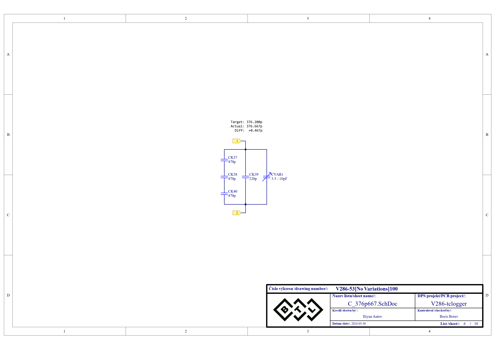
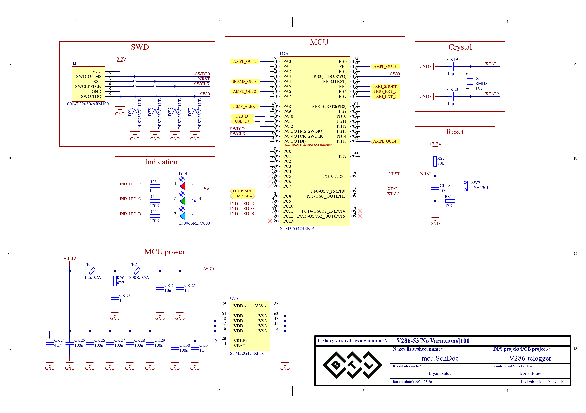
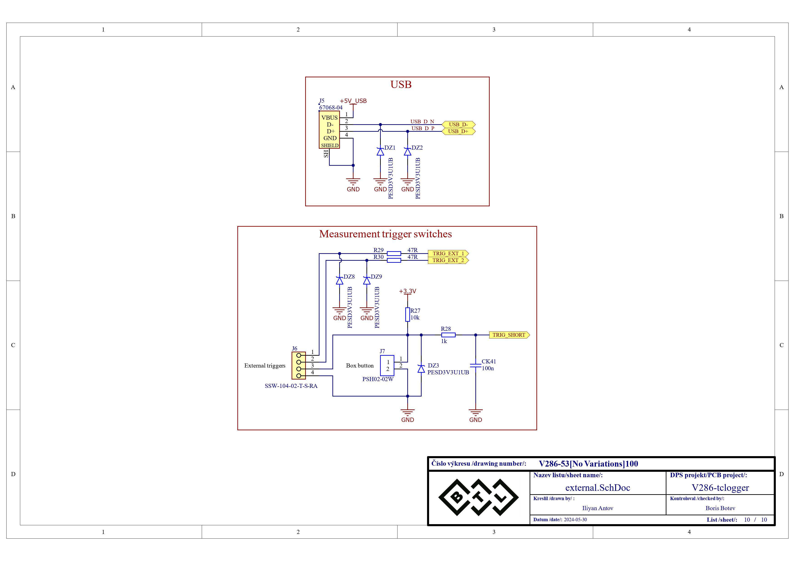

# Високоскоростен логер за термодвойки с ускорение на измерването High-speed thermocouple logger with measurement acceleration

## [Документация](./Documentation/DR_Iliyan_Antov_101220020.pdf)

## [Презентация на проекта](./Documentation/Presentation/High%20speed%20thermocouple%20logger.pptx)

## Блокова схема:

  

## Принципна електрическа схема:

  
  
  
  
  
  
  
  
  
  

## Печатна платка:

  

## Реализация:

  
  
  

## Използвани технологии:
* PC application: Python + PyQt5
* Firmware: C/C++
* MCU platform: STM32
* Schematics/Layout: Altium

## Автор:
Илиян Антов - [Iliyan Antov](https://github.com/IliyanAntov) - [i.antov2@gmail.com](i.antov2@gmail.com)